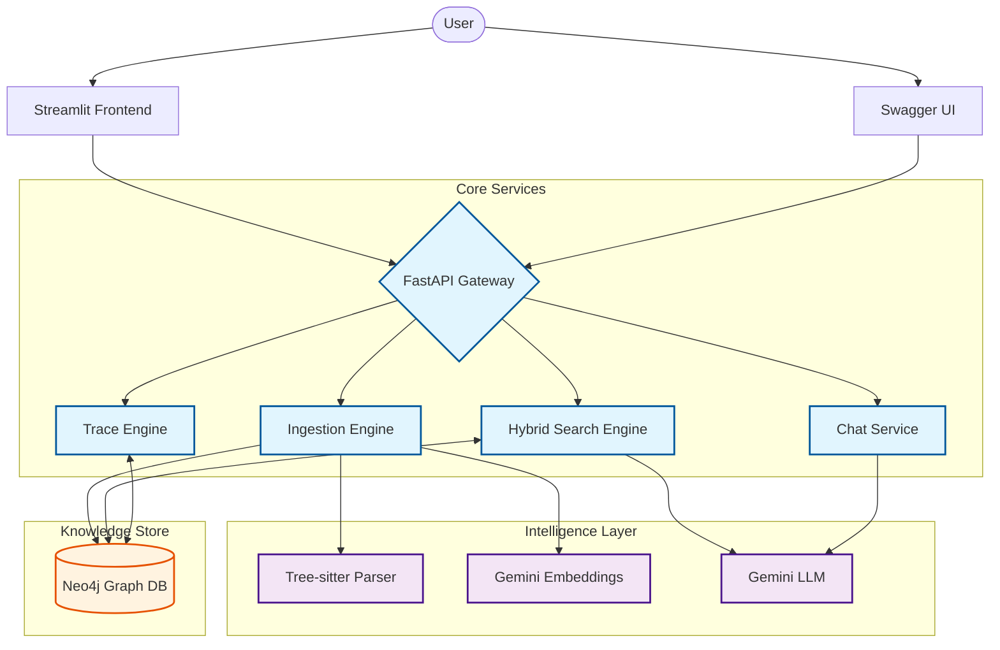
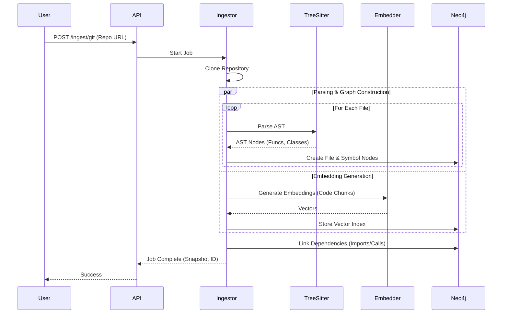
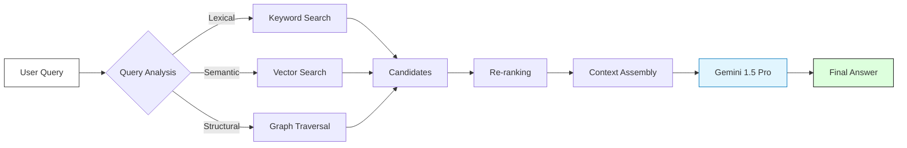

# 🚀 Repository Intelligence Agent

**Repository Intelligence Agent** is a powerful, AI-driven platform designed to ingest, analyze, and explore codebases. By combining **Neo4j** graph databases with **Google Gemini** LLMs, it provides deep insights into code structure, dependencies, and execution flows through a beautiful **Streamlit** interface.


---

## ✨ Key Features

*   **📂 Universal Ingestion**: Seamlessly ingest **Local repositories** or **GitHub URLs**.
*   **🕸️ Knowledge Graph**: Automatically builds a comprehensive graph of files, functions, classes, and their dependencies using **Tree-sitter** and **Neo4j**.
*   **🤖 RAG Chat**: Chat with your codebase using a Hybrid RAG approach (Vector + Keyword + Graph context).
*   **🔍 Advanced Search**: Find code using semantic meaning, strict keyword matching, or graph relationships.
*   **📊 Interactive Visualizations**:
    *   **Import Graphs**: Visualize file dependencies.
    *   **Call Graphs**: Explore function call chains.
    *   **API Surface Map**: Automatic discovery and categorization of API endpoints.
*   **🔬 Deep Trace**: Trace FastAPI endpoint execution flows from route to database, generating visual **Mermaid** diagrams of the logic path.

---

## 🛠️ System Architecture

The system follows a modern microservices-like architecture designed for scalability and depth of analysis.

### 1. High-Level Architecture



### 2. Ingestion Pipeline

The ingestion process converts raw code into a structured knowledge graph.



### 3. RAG Intelligence Flow

How the system answers questions about your code.



---

## 🚀 Setup & Installation

### 1. Prerequisites

*   **Python 3.13+**
*   **Neo4j Database**: You need a running Neo4j instance.
    *   [Download Neo4j Desktop](https://neo4j.com/download/) (Local)
    *   Or use [Neo4j Aura](https://neo4j.com/cloud/aura/) (Cloud Free Tier)
*   **Google Gemini API Key**: Get one from [Google AI Studio](https://aistudio.google.com/).

### 2. Clone the Repository

```bash
git clone https://github.com/HansalBhangale/Code-explainer.git
cd Code-explainer
```

### 3. Install Dependencies

Using `uv` (Recommended for speed):
```bash
# If you don't have uv installed: pip install uv
uv sync
```

Or using standard `pip`:
```bash
python -m venv .venv
# Windows
.venv\Scripts\activate
# Linux/Mac
source .venv/bin/activate

pip install -r requirements.txt
```

### 4. Configuration

Create a `.env` file in the root directory. You can copy `.env.example`:

```bash
cp .env.example .env
```

Update the `.env` file with your credentials:

```ini
# Neo4j Configuration
NEO4J_URI=bolt://localhost:7687
NEO4J_USER=neo4j
NEO4J_PASSWORD=your_password

# Google Gemini API
GEMINI_API_KEY=your_gemini_api_key
GEMINI_MODEL=gemini-1.5-flash

# App Settings
LOG_LEVEL=INFO
APP_ENV=development
```

---

## 🏃‍♂️ Usage

### Start the Backend API

Run the FastAPI server using Uvicorn:

```bash
uvicorn src.api.main:app --reload --host 0.0.0.0 --port 8000
```
*The API will be available at `http://localhost:8000`*

### Start the Frontend UI

In a new terminal, run the Streamlit app:

```bash
streamlit run app.py
```
*The UI will open automatically at `http://localhost:8501`*

---

## 📚 Detailed API Reference

The backend exposes a RESTful API grouped by functionality.

### 📥 Ingestion
| Method | Endpoint | Description |
| :--- | :--- | :--- |
| `POST` | `/api/v1/ingest/git` | Ingest a remote Git repository. Requires `remote_url` and `repo_name`. |
| `POST` | `/api/v1/ingest/local` | Ingest a local directory. Requires `local_path`. |

### 📂 Repository Management
| Method | Endpoint | Description |
| :--- | :--- | :--- |
| `GET` | `/api/v1/repos` | List all ingested repositories. |
| `GET` | `/api/v1/repos/{repo_id}` | Get metadata for a specific repository. |
| `GET` | `/api/v1/repos/{repo_id}/snapshots` | List version snapshots for a repository. |

### 🕸️ Graph & Files
| Method | Endpoint | Description |
| :--- | :--- | :--- |
| `GET` | `/api/v1/snapshots/{id}/files` | List all files in a snapshot. |
| `GET` | `/api/v1/snapshots/{id}/import-graph` | Get the full import dependency graph (Nodes/Edges). |
| `GET` | `/api/v1/snapshots/{id}/dependencies/{path}` | Get reverse dependencies (files importing the target). |
| `GET` | `/api/v1/call-graph/symbols/{id}/graph` | Get a function call graph centered on a symbol. |

### 🤖 RAG & Chat
| Method | Endpoint | Description |
| :--- | :--- | :--- |
| `POST` | `/api/v1/rag/search` | Perform a hybrid search (Lexical + Vector + Graph). |
| `POST` | `/api/v1/rag/search/explain` | Search and generate an AI explanation for code chunks. |
| `POST` | `/api/v1/chat/message` | Send a natural language query to the codebase chat agent. |

### 🔬 Deep Trace
| Method | Endpoint | Description |
| :--- | :--- | :--- |
| `GET` | `/api/v1/trace` | Trace a FastAPI endpoint's execution flow. Returns a Mermaid diagram. |

### 📊 Metadata & Types
| Method | Endpoint | Description |
| :--- | :--- | :--- |
| `GET` | `/api/v1/snapshots/{id}/endpoints` | List all discovered FastAPI endpoints in the codebase. |
| `GET` | `/api/v1/snapshots/{id}/api-surface` | Get a categorized map of the API surface. |
| `GET` | `/api/v1/types/snapshots/{id}/type-stats` | Get usage statistics of Python types/classes. |

---

## 📁 Project Structure

```text
Code-explainer/
├── app.py                  # Streamlit Frontend Entry Point
├── pyproject.toml          # Project Dependencies & Config
├── src/
│   ├── api/                # FastAPI Routes & Main App
│   │   ├── main.py         # Backend Entry Point
│   │   └── routes/         # API Route Handlers
│   ├── database/           # Neo4j Database Logic
│   ├── services/           # Business Logic (Ingestion, RAG, Trace)
│   ├── parsers/            # Tree-sitter Code Parsers
│   └── models/             # Pydantic Data Models
├── frontend/               # (Optional) Extra frontend assets
└── vendor/                 # Vendorized dependencies (if any)
```
